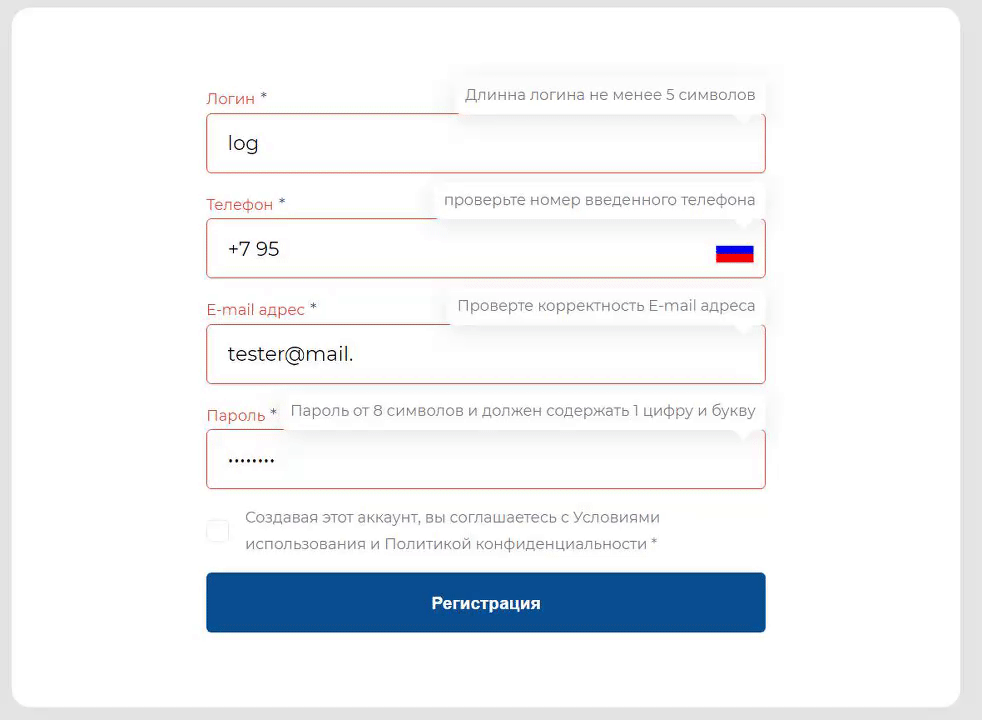

# Vue Form Validate


## Что это и зачем
Данный модуль (точнее набор mixin-ов и компонентов) для Vue 2 - это набор правил для создания форм, их валидации и кастомизации. Это не панацея, но хоть какое то решение на фоне всего остального мрака.

## Как это работает
Много магии). Основано все на миксинах (используется вместо наследования) и доверии (интерфейс). В js без доверия ни как).

Все это основано на 3 базовых элементах:
- Формы (FveMixinForm.vue)
- Элементы формы (FveFieldMixin.vue и FveTemplateField.vue)
- TODO Группа элементов (FveMultiMixin.vue и FveMultiTemplate.vue)

## Как установить
1) В своем проекте, в папке где лежат все компоненты создаем папку FormValidate (по умолчанию будет src/components/FormValidate )
2) Рядом создать папку для FormValidateCustom для своих элементов формы (заточеных под проект)
3) В корне проекта создать vue.config.js (если его нет) и добавить 
```js
const path = require("path");

module.exports = {
  chainWebpack: (config) => {
    // WARNING - укажи путь к своей папке!!! (замени /src/components/FormValidate src на свой путь)
    config.resolve.alias.set('@widgetFormValidate'       , path.join(__dirname, './src/components/FormValidate')   );
    config.resolve.alias.set('@widgetFormValidateCustom' , path.join(__dirname, './src/components/FormValidateCustom')   );
  }
}
```
4) установить пакеты (не обязательно)
- "dayjs": "^1.8.36", (легкая библиотека для работы с датой, нужна для datepicker)
- "v-calendar": "^2.3.0", (необходимо для поля даты)
- "vue-phone-mask-input": "^1.1.11", (необходимо для поля телефон)
- "v-mask": "^2.2.4",

5) перезапустить сборку

## Почему не npm install?
Приходиться затачивать некоторые вещи именно под проект и сейчас нет времени сделать большую инициализацию всего этого...
Возможно когда-то это случиться и будет магия с npm i. Сейчас же это позволяет проще развивать данное решение.

# Как создать свою форму
Форма создается как обычный компонент, за исключением того, что мы добавляем необходимые миксины, а в родителе формы слушаем @submit
```vue
<template>
  <!--
     @submit.prevent="formSubmit" - вызывает событие обработки в миксине FveMixinForm
     novalidate="novalidate"      - отключаем браузерную валидацию полей
  -->
  <form @submit.prevent="formSubmit" novalidate="novalidate">
    <!-- 
      formSubmit - будет обрабатывать только поля с миксином FveFieldMixin
      обычные поля типа input, select и тд будут просто игнориться
    -->

    <!-- form element start -->
    
    <!-- это пример как использовать простое текстовое поле -->
    <FveText
      v-model="form.name"
    />

    <!-- form element end -->

    <!-- 
      Маленький совет, не забываем указывать type="button" 
    -->
    <button type="button" @click="formSubmit">submit</button>
  </form>
</template>

<script>
// подключаем необходимые поля для формы
import FveText from "@widgetFormValidate/src/Element/Text/FveText";
// подключаем миксин формы
import FveMixinForm   from "@widgetFormValidate/src/Mixin/FveMixinForm";

export default {
  mixins: [
    FveMixinForm
  ],
  components: {
    FveText,
  },
  methods: {
    // необходимо описать, какие данные мы хотим получить в виде полной схемы без сокращений (как props)
    // хотелось взять валидацию props из самого vue js - но она написана на столько криво...,
    // что ее не возможно переиспользовать
    formSchema() {
      return {
        name: {
          type: String,
          default: () => { return ''; }
        },
      };
    },
  }
};

</script>
```

# Как создать свой элемент формы
Все просто, необходимо только использовать миксин FveFieldMixin
Рассмотрим все на примере обычного текстового поля
```vue
<template>
  <FveTemplateField>
    <!-- FveTemplateField - это однообразная обертка для всех наших полей -->
    <input
        :type="type"
        :name="name"
        :placeholder="placeholder"
        :readonly="readonly"
        :disabled="disabled"
        :value="value"
        :required="required"
        @input="inputFormElement"
        @change="inputFormElement"
    />
    <!-- 
      @input="inputFormElement"                  - тут мы следим за нашим value
      @change="inputFormElement"                 - inputFormElement - функция миксина, она отвечает за логику обработки.

      @keypress.enter="$emit('keypress-enter')"  - добавляет в форму отправку по нажатию enter
    -->
  </FveTemplateField>
</template>

<script>

import FveFieldMixin from "@widgetFormValidate/src/Mixin/FveFieldMixin";

export default {
  mixins: [
    FveFieldMixin
  ],
  props: {
    // value, min, max - это то чему необходимо задать тип и значение по умолчанию
    // остальное берется из FveFieldMixin обеспечивая единообразие
    value    : { type: String, default: '' },
    /* 
     * на всякий случай) все это указано в FveFieldMixin -> props и переопределять все это нет смысла!
     * // стилистика
     * label       : { type: String, default: '' },
     * name        : { type: String, default: '' },
     * placeholder : { type: String, default: '' },
     * readonly    : { type: Boolean, default: false },
     * disabled    : { type: Boolean, default: false },
     * // валидация
     * required         : { type: Boolean, default: true },
     * validateRealtime : { type: Boolean, default: true },
     */
  },
  // data применяется для наследования, в вашем компоненте ее может и не быть
  data(){
    return {
      // type - вынесен в data для того что бы его можно было переопределить в наследниках на password, number и тд..
      type: 'text',
    };
  },
  // это то что нам необходимо реализовать...
  methods: {
    // сюда приходят события или неочищенные или не преобразованные данные. Нам необходим достать чистые данные.
    // смотрим на props value => String
    prepareValue($event) {
      return $event.target.value;
    },
    // проверка на то что поле не заполнено (используется для обязательных полей)
    isEmpty(value) {
      return value === '';
    },
    // функция валидации. Если все хорошо то отдаем 'SUCCESS', если есть ошибки, то отдаем текст с текстом ошибки
    // на данный момент, нет разных статусов ошибок (warning, error)
    // все что не 'SUCCESS' то error message.
    validateFunction(str) {
      return 'SUCCESS';
    },
  }
};
</script>

<style lang="scss" scoped>
// используются стили которые не влияют на весь проект и на чужие компоненты (которые используют select, input и тд...)
@import '~@widgetFormValidate/style/const.scss';
@import "~@widgetFormValidate/style/inputText.scss";

</style>
```

Или использовать в качестве основы созданный компонент. Например FveText.
```vue
<script>

import FveText from "@widgetFormValidate/src/Element/Text/FveText";

export default {
  mixins: [
    FveText
  ],
  methods: {
    // переопределяем только валидацию текстового поля и на этом все)
    validateFunction(str) {
      if(str.length < 5 ){ return 'Длинна логина не менее 5 символов'; }
      // mут можно проверить еще что нибудь....
      return 'SUCCESS';
    },
  }
};
</script>
```


## Хочу изменить вид полей...
Нет проблем, в папке style есть настройки переменных css variable (const.scss) и общие стили для input полей (inputText.scss).
Так же есть общий template для всех полей - FveTemplateField.vue (в корне).


## Как это будет выглядеть
В "~/FormValidate/test/page/UiKit.vue" добавлены элементы формы, можно посмотреть, как все это будет выглядеть.


## Еще больше документации
Да я тоже хочу еще больше документации, но времени на написание документации тратиться много.
А при развитии всего этого, она устаревает еще быстрее чем пишется).
В данном случае, не надо боятся заглянуть в миксины (они не на столько сложные и большая часть будет понятна всем).
По созданию своих элементов формы, примеры можно посмотреть в папке Element

## Пример как это использовать на форме авторизации
Фаил формы авторизации (AuthForm): 
```vue
<template>
  <form class="form-auth form-base" @submit="formSubmit"  @submit.prevent="formSubmit">
    <LoginFormElement
        name="login"
        label="Логин"
        v-model="form.login"
        @keypress-enter="formSubmit"
    />
    <PasswordFormElement
        name="password"
        label="Пароль"
        v-model="form.password"
        @keypress-enter="formSubmit"
    />
    <button type="button" @click="formSubmit" class="btn btn-prime">Войти</button>
  </form>
</template>

<script>

import LoginFormElement    from "@widgetFormValidate/src/Element/Text/FveLogin";
import PasswordFormElement from "@widgetFormValidate/src/Element/Text/FvePassword";
//
import FveMixinForm   from "@widgetFormValidate/src/Mixin/FveMixinForm";

export default {
  mixins: [
    FveMixinForm
  ],
  components: {
    LoginFormElement,
    PasswordFormElement,
  },
  methods: {
    formSchema() {
      return {
        login: {
          type: String,
          default: () => { return ''; }
        },
        password: {
          type: String,
          default: () => { return ''; }
        },
      };
    },
  },

};
</script>
```

И файл обработки данной формы
```vue
<template>
  <div>
    <FormAuth @submit="authSubmit" />
  </div>
</template>

<script>

import FormAuth from '@component/Form/Auth';

export default {
  components: {
    FormAuth
  },
  methods: {
    // вызовется если вся форма валидна
    authSubmit (data) {
      console.log('Auth form submit data', data);
    },
  
  },
};

</script>
```
